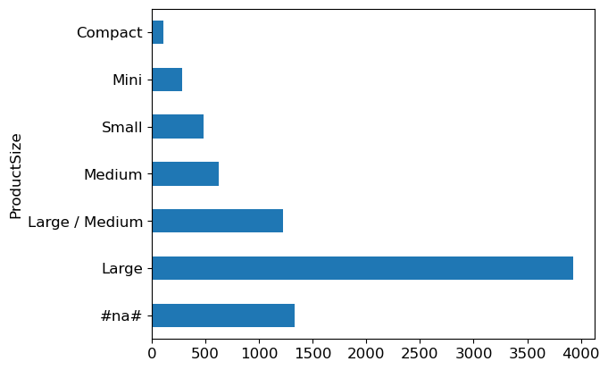
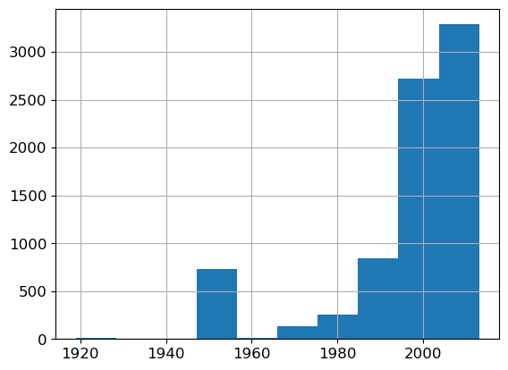
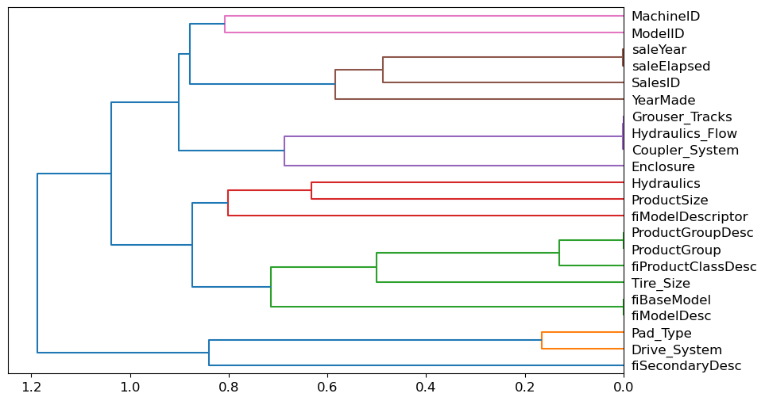
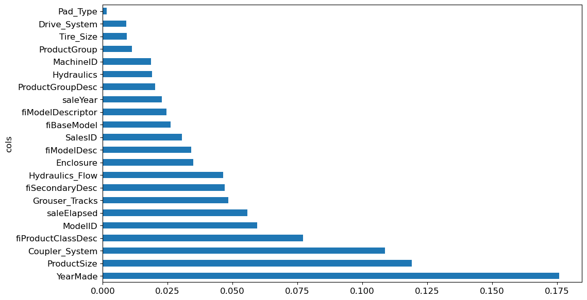
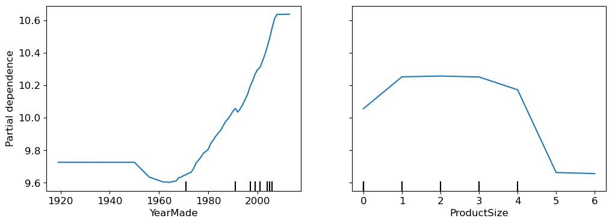
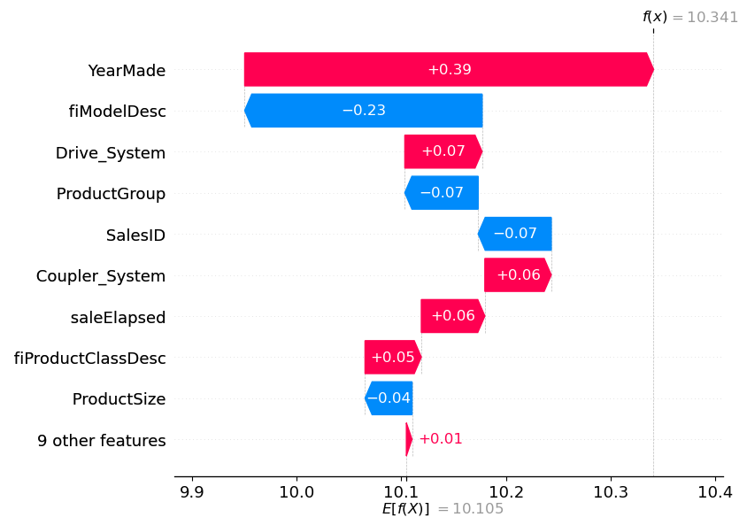
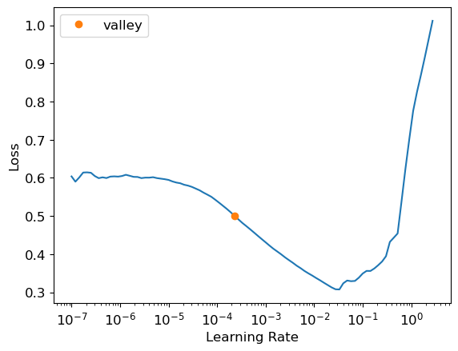
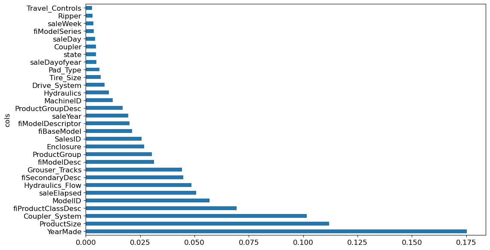
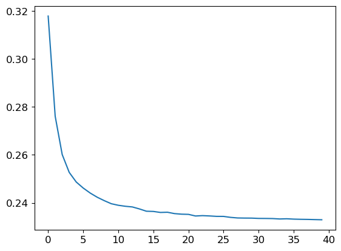

# 🏆 Kaggle Tabular Data Competition – My Solution (Top 3% Finish)


This repository documents my full workflow for a Kaggle **tabular data competition**, where I achieved a **Top 3% leaderboard ranking** (Public LB score: 0.2309).  
The project represents my most sophisticated work so far, covering **data preprocessing, exploratory analysis, feature engineering, boosting models, neural networks, stacked ensembling, and interpretability**.

---

## 📌 Path I Took

This README is structured as a **narrative** of the steps I took, with visualizations at each stage to explain the decisions and techniques I used.

---

## 🔍 1. Exploratory Data Analysis (EDA)

I started with **distribution analysis** of the categorical and numeric features. For example, the `ProductSize` variable showed strong class imbalance, while `YearMade` revealed historical patterns in the dataset.




- Identified missing values in categorical features like `ProductSize`.  
- Observed skewed year distribution, requiring binning and transformations.  

---

## 🛠 2. Feature Correlation & Redundancy Check

To avoid redundant features, I used **hierarchical clustering** and correlation plots to understand dependencies between features.



This step helped identify collinear features and guided feature selection for models like linear/logistic regressors, which are sensitive to multicollinearity.

---

## 🧩 3. Feature Importance (Baseline Models)

Next, I trained early LightGBM/XGBoost models to check **feature importance**.



Key findings:
- `YearMade`, `ProductSize`, and `Coupler_System` were the strongest predictors.  
- Some IDs (`MachineID`, `ModelID`) carried signal due to being proxies for hidden categorical structures.  

---

## 🔬 4. Partial Dependence & Interpretability

To further understand how the most important features affected predictions, I plotted **Partial Dependence Plots (PDPs)**.



- `YearMade`: newer machines correlated with higher target values.  
- `ProductSize`: larger equipment influenced outcomes strongly.  

Additionally, I generated **SHAP-style explanations** to understand feature contributions at the instance level.



---

## ⚙️ 5. Feature Engineering

Based on the insights:
- Created ratios (`rooms_per_household`, `bedrooms_per_room`, etc. for analog variables).  
- Engineered domain-driven transformations like **log-scaling** skewed numeric variables.  
- Encoded categorical variables with **OneHotEncoding** and **CatBoost encoding**.  
- Applied **binning** for features with skewed distributions.  

---

## 🤖 6. Model Training

I benchmarked several models:

- **Gradient Boosting**:  
  - LightGBM (best single model)  
  - XGBoost  
  - CatBoost  

- **Neural Network**:  
  - Simple dense net with BatchNorm + Dropout  
  - Tuned learning rate schedules  

Learning rate finder example:



Training curves:



---

## 🧬 7. Ensembling & Stacking

The biggest performance gain came from **stacked ensembling**:
- First layer: LightGBM, XGBoost, CatBoost, Neural Net.  
- Meta-model: Logistic Regression / LightGBM.  
- Final submission: weighted blending of top learners.  

This reduced variance and improved generalization.  

---

## 📊 8. Final Feature Importance (Stacked Model)

After stacking, I re-evaluated feature importances:



- `YearMade` and `ProductSize` consistently dominated across all boosting models.  
- Cross-validation confirmed their predictive stability.  

---

## 🏅 9. Results

- **Leaderboard Rank**: Top 3%  
- **Public Score**: 0.2309  
- **Insight**: Stacked ensembles outperformed single learners by a clear margin.  
- **Interpretability**: Used PDPs, SHAP, and feature importances to explain models.  

---

## 🧰 Tech Stack

- **Languages**: Python  
- **Libraries**: Pandas, NumPy, scikit-learn, XGBoost, LightGBM, CatBoost, PyTorch, Matplotlib, Seaborn  
- **Tools**: Jupyter Notebook, Git/GitHub  

---

## 🚀 How to Run

1. Clone the repo:
   ```bash
   git clone https://github.com/yourusername/kaggle-tabular-competition.git
   cd kaggle-tabular-competition
